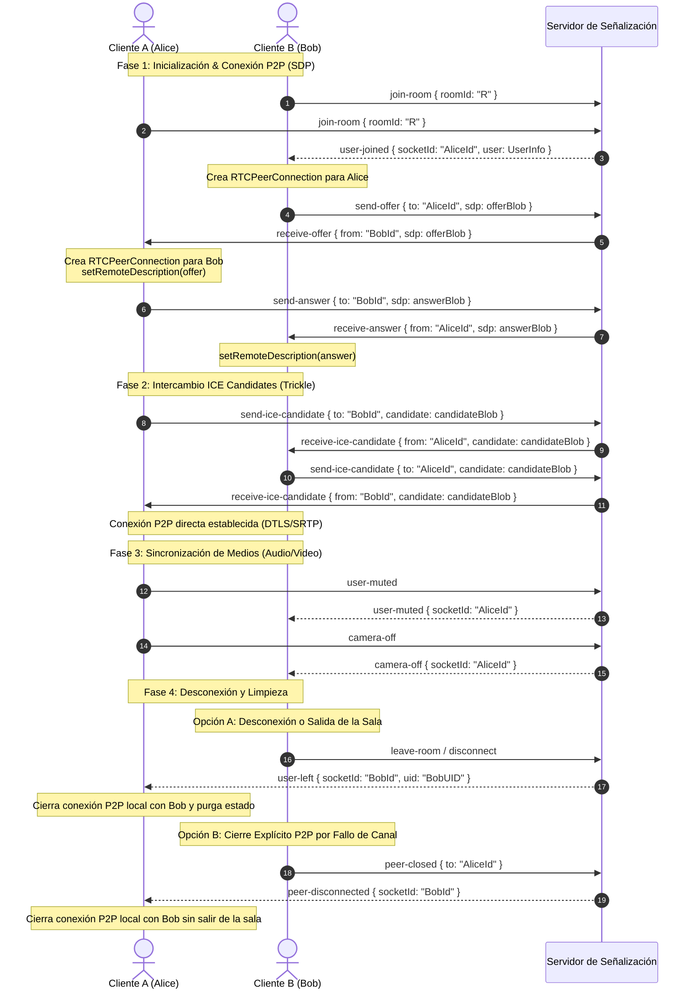

# Arquitectura de Señalización WebRTC

Backend de señalización para las salas en tiempo real de UniDesk. **Solo
backend.** El servidor Socket.io en tiempo real (`backend_realtime/`) retransmite
la señalización WebRTC entre pares; no se modifica nada del frontend.

- **Runtime:** Node + TypeScript (ESM, `tsx`), Socket.io `^4.8`.
- **Auth:** middleware existente de token de ID de Firebase
  (`io.use(socketAuthMiddleware)`).
- **Modelo de salas:** sin cambios, en memoria
  `Map<roomId, Map<socketId, UserInfo>>` (ver *Compatibilidad* más abajo).

---

## 1. Principio de diseño: el servidor es un relay tonto

El servidor en tiempo real **nunca analiza, valida ni reescribe los blobs de
SDP o ICE**. Son payloads opacos (`unknown`) propiedad exclusiva del
`RTCPeerConnection` del frontend. Las únicas tareas del servidor en la
señalización son:

1. Verificar que emisor y destino están **co-ubicados en una sala**
   (`areInSameRoom`).
2. Retransmitir el blob opaco al socket destino.
3. Marcar `from` con el **id de socket del emisor verificado por el servidor**
   — nunca un valor que suministre el cliente.
4. **Reportar fallos:** ante cualquier validación fallida, el emisor recibe un
   evento `signaling-error` y el servidor lo loguea. Una retransmisión
   rechazada nunca es silenciosa.

---

## 2. Convención de nombres de eventos

| Dirección | Evento | Propósito |
|---|---|---|
| `Cliente A → Server` | `send-offer` | Entregar una oferta SDP a un par específico |
| `Server → Cliente B` | `receive-offer` | Oferta retransmitida con `from` verificado |
| `Cliente B → Server` | `send-answer` | Entregar una respuesta SDP de vuelta al oferente |
| `Server → Cliente A` | `receive-answer` | Respuesta retransmitida con `from` verificado |
| `Cliente → Server` | `send-ice-candidate` | Entregar un candidato ICE trickleado |
| `Server → Cliente` | `receive-ice-candidate` | Candidato retransmitido con `from` verificado |
| `Server → Emisor` | `signaling-error` | Reporte de fallo de retransmisión |
| `Cliente → Server` | `peer-closed` | Notifica cierre/falla local de conexión con un par específico |
| `Server → Cliente` | `peer-disconnected` | Notifica al par que la conexión P2P se ha cerrado/fallado |
| `Cliente → Server` | `user-muted` / `user-unmuted` | Cambia el estado de silencio de audio local |
| `Server → Cliente` | `user-muted` / `user-unmuted` | Retransmite cambio de audio a la sala con `socketId` del emisor |
| `Cliente → Server` | `camera-on` / `camera-off` | Cambia el estado de habilitación de cámara local |
| `Server → Cliente` | `camera-on` / `camera-off` | Retransmite cambio de video a la sala con `socketId` del emisor |
| *(implícito)* `join-room` | `user-joined` | Avisa a los pares existentes |
| *(implícito)* `leave-room` / `disconnect` | `user-left` | Avisa a los pares restantes |

---

## 3. Estructuras de los mensajes (payloads)

Todas definidas en [`src/signaling.ts`](../src/signaling.ts).

### 3.1 Cliente → Servidor

```ts
interface SendOfferPayload        { to: string; sdp: unknown; }      // to = socket id del destino
interface SendAnswerPayload       { to: string; sdp: unknown; }
interface SendIceCandidatePayload  { to: string; candidate: unknown; }
interface UserInfo                { uid: string; username: string; roomId: string; avatar?: string; audioEnabled?: boolean; videoEnabled?: boolean; }
```

`to` es siempre el **socket id** del par destino, no el `uid` de Firebase.

### 3.2 Servidor → Cliente (retransmitido)

El servidor reemplaza cualquier `from` suministrado por el cliente con el socket id verificado del emisor antes de retransmitir:

```ts
interface ReceiveOfferPayload        { from: string; sdp: unknown; }
interface ReceiveAnswerPayload       { from: string; sdp: unknown; }
interface ReceiveIceCandidatePayload { from: string; candidate: unknown; }
```

### 3.3 Eventos de presencia y estado de medios

```ts
interface UserJoinedPayload { socketId: string; user: UserInfo; }  // a los pares EXISTENTES
interface UserLeftPayload    { socketId: string; uid: string; }    // a los pares RESTANTES
```

- `user-joined` se emite con `socket.to(roomId)` — el que entra **no** recibe su propio evento de join. Los pares existentes lo usan para iniciar ofertas.
- `user-left` se emite con `io.to(roomId)` a quien quede, para que pueda llamar `pc.close()` sobre la conexión del par que se fue.

### 3.4 Reporte de errores: `signaling-error`

```ts
type SignalingErrorReason =
  | "not-authenticated"     // socket.user ausente
  | "missing-target"        // no se envió `to`, o no es string
  | "missing-payload"       // no se envió sdp/candidate
  | "not-co-located"        // el destino existe pero NO comparte sala con el emisor
  | "target-disconnected";  // el socket destino no existe (se fue o es fantasma)

interface SignalingErrorPayload {
  event: string;            // "send-offer" | "send-answer" | "send-ice-candidate"
  reason: SignalingErrorReason;
  target?: string;          // el socket id que el emisor intentó alcanzar
}
```

---

## 4. Flujo de conexión P2P

Dos participantes **A** (Alice) y **B** (Bob) en la sala `R`. Ambos ya deben haber llamado `join-room`, por lo que se encuentran en el mapa `rooms` y en la sala Socket.io `R`.



### Gestión de Conexiones Activas (`activePeerConnections`)
El servidor mantiene el mapa `activePeerConnections` para registrar dinámicamente qué pares han establecido o iniciado una negociación WebRTC entre sí.
- **Creación**: Se agrega la relación al relevar de manera exitosa una oferta (`send-offer`).
- **Destrucción**: Al recibir `leave-room` o `disconnect` se invocan rutinas seguras que eliminan de memoria la estructura de par en ambos lados.
- **Fallas de Red / Cierre Explícito**: El cliente puede disparar `peer-closed` para purgar de manera directa la referencia de un canal dañado y notificar al otro cliente a través de `peer-disconnected` sin afectar la permanencia en la sala.

---

## 5. Frontera de seguridad: `areInSameRoom`

[src/signaling.ts](../src/signaling.ts) exporta funciones puras que consulta
cada retransmisión:

```ts
function areInSameRoom(rooms: RoomsMap, a: string, b: string): boolean
function findRoomOf(rooms: RoomsMap, socketId: string): string | null
```

`areInSameRoom` devuelve true solo si ambos sockets comparten actualmente al
menos una sala. Es robusto ante membresía multi-sala (un socket puede unirse
legítimamente a varias salas), verificando el invariante real — co-ubicación —
en vez de "la primera sala coincide".

Garantías que esto impone:

1. **Sin señalización entre salas.** Un par en la sala A no puede enviar
   ofertas a un par que solo está en la sala B.
2. **`from` con autoridad del servidor.** El `from` retransmitido es
   `socket.id` tomado de la conexión autenticada, así que un par no puede
   hacerse pasar por otro.
3. **Autenticación.** Cada retransmisión también cortocircuita si
   `!socket.user`.

Un self-check ejecutable vive al final de `signaling.ts`:

```bash
node --import tsx src/signaling.ts   # → "all self-checks passed"
```

---

## 6. Compatibilidad con el modelo de salas existente

La capa de señalización **se suma al** modelo de salas existente; no cambia nada
de cómo se trackean las salas ni de cómo funciona el chat.

| Comportamiento existente | Estado |
|---|---|
| `join-room` → mapa de membresía + `socket.join(roomId)` + `chat-history` + `room-participants-update` | **Sin cambios** — se añade `user-joined` junto a `room-participants-update` |
| `send-message` / `edit-message` (chat respaldado en Firestore) | **Intacto** |
| `leave-room` / `disconnect` → `handleLeaveRoom` + `room-participants-update` | **Sin cambios** — se añade `user-left` junto a `room-participants-update` |
| Mapa `rooms` en memoria (se pierde al reiniciar) | **Sin cambios** — la señalización lee el mismo mapa |
| Middleware de auth de Firebase | **Sin cambios** — las retransmisiones reusan `socket.user` |

Notas heredadas de la arquitectura previa (no introducidas aquí, ni arregladas
aquí — fuera del alcance de la señalización):

- `rooms` es solo en memoria; un reinicio borra toda la membresía, y nunca se
  reconcilia con la colección `rooms` de Firestore en `backend_main`.
- `join-room` no valida que `roomId` exista en Firestore.
- `leave-room` llama a `socket.leaveAll()`, saliendo de todas las salas a la
  vez.

Estas son preexistentes y ortogonales a la señalización.

---

## 7. Supuesto de topología mesh

Este diseño implementa una **mesh completa** dentro de una sala: cada
participante mantiene un `RTCPeerConnection` directo con todos los demás. Es lo
más simple y correcto para salas pequeñas (el caso esperado de UniDesk). **No**
escala a salas grandes (O(n²) conexiones). Cuando eso sea un requisito real, el
protocolo de señalización de arriba no cambia; solo cambia la *estrategia de
conexión del cliente* (selección de SFU) — que es trabajo del frontend, fuera
del alcance de esta tarea.
